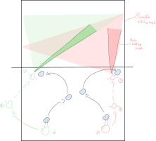

# Beach volleyball attack

This guide comes in right after a good pass.

## Steps

### 1. Positioning

Where your position is depends on great amount of things. First let's make clear
where to hit at which angle.

**Hitting angle**:

> Angle yourself so that you can hit any place on opposite side of court -- a
> right handed person can always play more to the left by tucking the arm in.

Hitting angle predetermines your starting position:

> Right after pass go wait for the set to a spot such that you'll run straight
> to where you want to hit the ball at the angle you want to hit it.

Additional random notes:
- don't be to far from the hitting spot -- only 3 steps away

### 2. Run-up

The run-up takes 3 steps in total. For a person that jumps from his/her left:
1. left short directional step,
2. right **long** step to gain momentum, hands swing backwards,
3. left short step pivoting the body in preparation for the hit, jumping up,
   hands swing upwards.

The second step is the important one.

> Small second step means you'll be jumping into distance rather than up.

The second step also plays together with the hitting.

> It is more comfortable to do the second step (essentially jumping) into the
> ball.

So right-handed player will make the first step such that if the setter will set
really left the hitter will be straight. But if the setter will set correctly or
more to the right of the hitter, it will be easy because the hitter "steps into"
the set.

TODO: image

> During the run-up you also look where to hit.

### 3. The hit

Your arm should be swinging high naturally from the third step of the run-up.
Keep your elbow high and for roll shots your hand as well (for hits your hand
will be naturally up from the centrifugal force of the arm swing).

> Timing of your hand can make-up mistiming of the run-up to some degree.

Fast hand to catch up to fast balls, slower one if you jumped slightly sooner.

> Ideally the hand is fast as can be not to loose energy from the run-up.

### Summary

1. position towards hitting spot at hitting angle,
2. directional step so you'll be stepping into the set,
3. look for a spot where to hit,
4. long second step to the set,
5. short step pivots body,
6. with elbow high and fast hand hit the ball
