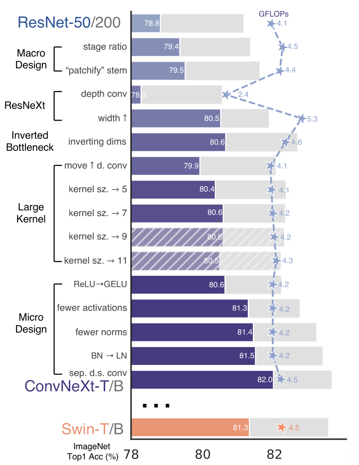

# ConvNeXt

ConvNeXt net is a convolution architecture that puts from multiple improvements
of convolution nets, that were researched separately, together. These
improvements snowballed and surpassed previous SOTA in image processing set by
transformers ([Swin Transformer](./swin_transformer.md) or ViT).

ConvNeXt was introduced by [Liu et al. (Facebook)
(2022)](https://openaccess.thecvf.com/content/CVPR2022/papers/Liu_A_ConvNet_for_the_2020s_CVPR_2022_paper.pdf).

**The paper summarizes advancements in image processing very well and serves as
a nice overview of the progress made.**

## Architecture

The authors build ConvNeXt net by improving ResNet. They rely on findings from
more modern architectures (the mentioned ViT or Swin Transformer) and see if
they improve ImageNet-1K scores on hold-out split. The quoted number is Top1
classification accuracy in percentage (100% == 1.0 accuracy).

### Improvements

#### Training

First improvements were to bring "modern" optimization from Transformers to
ResNET.

- longer training: 90 -> 300 epochs
- AdamW optimizer
- data augmentation techniques -- Mixup, Cutmix, RandAugment, Random Erasing
- regularization schemes -- Stochastic Depth, Label Smoothing

Improvement: 76.1% -> 78.8%

#### Macro design

Then come the high-level architecture choices:

- **compute ratio**
  - ResNet computation complexity evolved through hierarchical stages in ratios
    1:1:3:1.
  - Swin transformers' ratios are 1:1:9:1.
  - So authors adjusted the number of layers in each stage to match Swin
    transformers' compute ratios.
  - Improvement: 78.8% -> 79.4%

- **first layer ingest operation**
  - ResNet uses large kernel (7x7) convolution with stride (2), followed by
    max pool. => (4x downsampling)
  - ViT and Swin transfromers use "patchify" -- cuts image into non-overlapping
    patches. ViT uses patches 14x14, SwinT uses 4x4.
  - Authors used convolution 4x4 with stride 4.
  - Improvement: 79.4 -> 79.5%

- **ResNeXt tricks**
  - [ResNext](./resnext.md) brought grouped convolutions and in few words used
    more groups, and expanded width (number of channels).
  - [MobileNet](./mobilenet.md) introduced depth-wise convolution = grouped
    convolution with as many groups as there are channels.
  - Authors see similarities between depth-wise convolution followed by 1x1
    convolution and self-attention followed by feed forward layers. Both
    architectures first mix tokens between each other, but do not mix channels,
    then mix only channels, but not between tokens.
  - Both points hint that [depth-wise separable block](./convolution_in_ml.md)
    are the way to go. So the authors transition to depth-wise convolutions,
    while increasing the number of channels as per ResNeXt to match FLOPs of the
    original network.
  - Improvement: 79.5% -> 80.5%

- **inverted bottleneck**
  - [Transformer](./transformer.md) uses inverted bottleneck -- increasing
    hidden dimension and decreasing it back during in feed forward layers.
  - Using inverted bottleneck idea (increasing number of channels for depth-wise
    convolution) didn't increase FLOPs since some are saved in residual
    downsampling connections.
  - Improvement: 80.5% -> 80.6%

- **do not mix positions with many channels**
  - with inverted bottleneck and depth-wise convolutions we know have:
    - 1x1, K channels
    - depth-wise 3x3, 4xK channels
    - 1x1, K channels
  - i.e we mix information between positions in the point in our network, where
    we have the most mount of channels
  - despit the detph-wise convolution, this still increases computation
    complexity, **even more with larger kernels**
  - moving the depth-wise convolution before the inverted bottleneck would lower
    the computation complexity and also match Transformer design (attention ->
    MLP w/ inverted bottleneck)
  - Improvement: 80.6% -> 79.9%

- **increasing kernel size**
  - On it's own the previous change worsens the results, but it was needed for
    increasing the kernel size.
  - Increased kernels correspond to the larger context window of (even local)
    self-attentions of Transformers
  - The authors use 7x7 kernel for the depth-wise convolution. (larger kernels
    had worse scores)
  - Improvement: 79.9% -> 80.6% (so matching the score two improvements back)

##### Micro design

Looking at the individual layers:

- **replacing ReLU with [GELU](./gelu.md)**
  - Follows the most advanced Transformers (e.g. ViTs)
  - Improvement: 80.6% -> 80.6%

- **fewer activations**
  - Transformers have less activations per block than ResNet (or our netowrk so
    far).
  - Authors remove all GELUs expcepth from between two 1x1 convolutions.
  - Improvement: 80.6% -> 81.3%

- **fewer normalization layers**
  - Transformers have less normalization layers per block than ResNet (or our
    netowrk so far).
  - Authors remove all Batch Norm (BN) layers except those between two 1x1
    convolutions.
  - Improvement: 81.3% -> 81.4%

- **substitution of BN for Layer Norm**
  - Some literature mentions that BN deteriorates performance.
  - Transformers use Layer Norm (LN).
  - Authors substitute BN for LN.
  - Improvement: 81.4% -> 81.5%

- **separate downsampling block**
  - ResNet used downsampling convolution at the start of each block.
  - Swin Transformers don't downsample inside a block with residual connection.
    Instead they use a separate downsampling block withtout residual connection.
  - Authors add a remove downsampling from normal blocks and introduce special
    downsampling block with LN before downsampling (to avoid diverging
    training).
  - Improvement: 81.5% -> 82.% (beating Swin Transformer's 81.3%)

#### Improvements summarized

Legend:
- bars are ImageNet-1K Top1 accuracy as percentages
  - blue bars: ResNet-50/Swin-T
  - grey bars: ResNet-200/Swin-B
- solid bars are improvements that were used, hatched bars are mark improvements
  that were tested, but discarded
- Stars are GFLOPs of the ResNet-50/Swin-T size model

## Evaluation

The authors validate the architectural changes on a range of model sizes and on
more tasks (COCO object detection and segmentation, ADE20K segmentation). Brief
summary:
- ConvNeXt net has better throughput than Swin Transformers and mostly better
  (otherwise on-par) performance accross model sizes and tasks
- Even with large pretraining (where Convolution's inductive bias is less
  visible), ConvNeXt models perform on par or better than their Transformer
  alternatives.
- Compared to the convolution alternatives (such as EfficientNetV2-L) ConvNeXt
  doesn't do that well. ConvNeXt models fall a bit behind w.r.t to throughput
  and performance on smaller datasets. With pre-training and larger datasets,
  ConvNeXt models outperform EfficientNetV2 models by a small margin. Though
  here the comparison is tricky, since previous convolution networks are trained
  with higher resolution images ($480^2$ EfficientNetV2-L vs $384^2$ of
  ConvNeXt).

