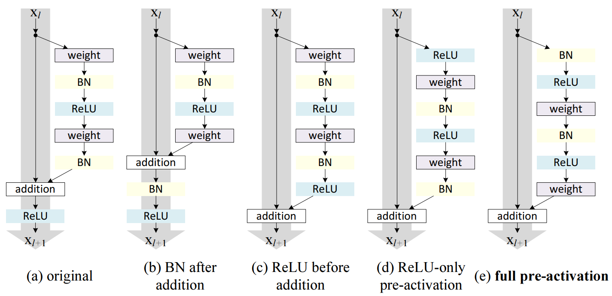

[mobilenet]: https://www.researchgate.net/profile/Marco-Andreetto/publication/316184205_MobileNets_Efficient_Convolutional_Neural_Networks_for_Mobile_Vision_Applications/links/5f8b50c9299bf1b53e2f1419/MobileNets-Efficient-Convolutional-Neural-Networks-for-Mobile-Vision-Applications.pdf

# Convolution

Convolution is a computation in machine learning typical for processing
$N$-dimensional sequences such as images (2D), signals (1D) or 3D maps. For an
input $I \in \mathbb{R}^{W \times H \times C}$ and kernel $K \in \mathbb{R}^{W_k
\times H_k \times C \times O}$ convolution is defined as:

$$
\left(K \star I\right)_{i, j, o} =
\sum_{m, n, c} I_{i\cdot S + m, j \cdot S + n, c} K_{m, n, c, o}
$$

Note that this is in fact *cross-correlation* however, the 'convolution' name
stuck so ...

## Variants

### Depth-wise separable convolution

Depth-wise separable convolution is a variant of convolution that saves on
parameter count. The variant was introduced as part of the [Mobilenet
model][mobilenet]. Basically input and output channels are not mixed and number
of input channels is equal to number of output channels:

$$
\left(K \star_{DW} I\right)_{i, j, c} =
\sum_{m, n} I_{i\cdot S + m, j \cdot S + n, c} K_{m, n, c}
$$

### Grouped convolution

Another way how to save on parameter count is to not let each output channel to
depend on each input channel. Instead we split channels to equally sized
**groups** and allow the convolution to compute an output for an output channel
only from input channels in the same group. This is called a **grouped**
convolution and can be achieved by passing parameter `groups` to a convolution
layer. Note that the \# of input channels and \# of output channels must both be
divisible by \# of groups.

## Blocks

### ResNet blocks

ResNet was a pioneer model using Convolutions in blocks with residual
connections. Later [He et al. (2016)](https://arxiv.org/pdf/1603.05027)
experimented with how layers are ordered in a residual convolution block:

The best is "*Full pre-activation*" block that
- has residual connections without any operations for gradients to easily
  [backpropagate](./rewrite/00002a.md)
- has no activations (ReLUs) before the non-linear computation gets added to the
  residual connections, since ReLUs would make roughly part of that computation
  useless (would zero-out negative numbers)
- has batch-norm before activations so that the results are actually non-linear
  -- activations are only non-linear near zero

### Separable blocks

[Mobilenet][mobilenet] introduced Depth-wise separable convolutions. However,
its lack of ability to mix channels between each other was so limiting, that it
was always used in "*Separable block*":

- Depth-wise convolution operating on channels separately
- 1x1 Regular convolution operating equally for all positions, but mixing input
  and output channels
