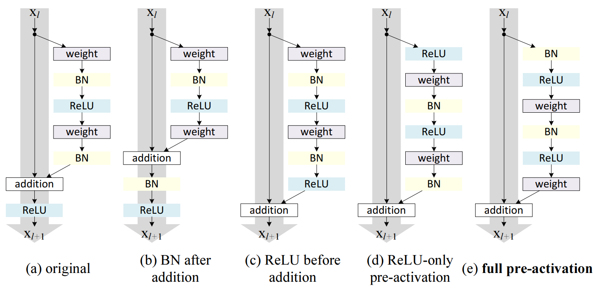

[mobilenet]: https://www.researchgate.net/profile/Marco-Andreetto/publication/316184205_MobileNets_Efficient_Convolutional_Neural_Networks_for_Mobile_Vision_Applications/links/5f8b50c9299bf1b53e2f1419/MobileNets-Efficient-Convolutional-Neural-Networks-for-Mobile-Vision-Applications.pdf

# Convolution in ML

Convolution is a computation in machine learning typical for processing
$N$-dimensional sequences such as images (2D), signals (1D) or 3D maps. For an
input $I \in \mathbb{R}^{W \times H \times C}$ and kernel $K \in \mathbb{R}^{W_k
\times H_k \times C \times O}$ convolution is defined as:

$$
\left(K \star I\right)_{i, j, o} =
\sum_{m, n, c} I_{i\cdot S + m, j \cdot S + n, c} K_{m, n, c, o}
$$

Note that this is in fact *cross-correlation* however, the 'convolution' name
stuck so ...

## Variants

### Point-wise convolution

Point-wise convolution is when the kernel is of size $1\times 1$. It is used to
mix only the input channels.

### Grouped convolution

[ResNeXts](./resnext.md) came up with the idea to split channels into equally
sized groups, which do not pass information, thereby saving up on parameter
count. Grouped convolution is created when you pass parameter `groups` to a
convolution layer. Note that the \# of input channels and \# of output channels
must both be divisible by \# of groups.

### Depth-wise convolution

[Depth-wise convolution](./mobilenet.md) takes a step further, by setting \# of
groups to \# of input channels.

## Blocks

### ResNet blocks

ResNet was a pioneer model using Convolutions in blocks with residual
connections. Later [He et al. (2016)](https://arxiv.org/pdf/1603.05027)
experimented with how layers are ordered in a residual convolution block:

The best is "*Full pre-activation*" block that
- has residual connections without any operations for gradients to easily
  [backpropagate](./rewrite/00002a.md)
- has no activations (ReLUs) before the non-linear computation gets added to the
  residual connections, since ReLUs would make roughly part of that computation
  useless (would zero-out negative numbers)
- has batch-norm before activations so that the results are actually non-linear
  -- activations are only non-linear near zero

### Depth-wise separable blocks

[Depth-wise separable convolutions](./mobilenet.md) is the concatenation of

- depth-wise convolution
- point-wise convolution (convolution with 1x1 kernel)

---
Sources:
- Nice animations: [animatedai.github.io](animatedai.github.io)
