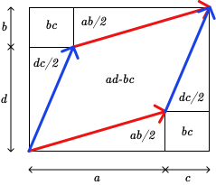

# Determinant

The determinant of a matrix $M \in \mathbb{R}^{n \times n}$ is defined as:

$$
\DeclareMathOperator{\sgn}{sgn}

\det M = |M| = \sum_{\sigma \in S_n} \sgn(\sigma) \prod_{i = 1}^n a_{i\sigma(i)}
$$

where:
- $\sigma$ is a permutation of $n$ elements
- $S_n$ is a permutation group -- set of all $\sigma$
- $\sgn$ is a sign of a permutation

## Geometric meaning

If we view the matrix $M$ as a [linear
transformation](./matrix_as_projection.md), then its determinant would give us
the amount of scaling the transformation does. To elaborate, imagine a hypercube
in the domain (e.g. 1x1 square for 2D), then the determinant of transformation
$M$ would tell us how much $M$ increases the volume of the hypercube. Since any
shape can be approximated with several of these hypercubes, we can safely assume
that any volume would get scaled $|M|$ times.

There is a little lie in the paragraph above. When the transformation flips
axes, **the determinant may become negative**. So scaling is given by the
absolute value of the determinant $|\det(M)|$.

The proof is not something that is intuitive, but we can build a little bit of
intuition by viewing the simple cases in small dimension. Let's imagine
following 2d transformations, for which the determinant is defined as:

$$
|M| = \begin{vmatrix}
a & c \\
b & d \\
\end{vmatrix} = ad - bc
$$

$$
M^1 = \begin{bmatrix}
a & 0 \\
0 & d \\
\end{bmatrix}
$$

$M^1$ scales axis $x$ by $a$ and axis $y$ by $d$. Its determinant is $|M^1| =
ad$. If we imagine 1x1 square, it would get projected to a $a\times d$ square,
ergo its volume would grow $ad$ times.

We can skew the square's image by skewing either the projection of $x$ axis:

$$
M^2 = \begin{bmatrix}
a & 0 \\
b & d \\
\end{bmatrix}
$$

or the $y$ axis:

$$
M^3 = \begin{bmatrix}
a & c \\
0 & d \\
\end{bmatrix}
$$

Either way, the determinant is still the same. This is accordance with the fact
that skewing of a square doesn't change its volume.

When we skew both axes, we get a different volume. We can rewrite determinant
as:

$$
\begin{aligned}
\det(M) &= (a + c)(b + d) - ab - dc - 2bc\\
&= ab + ad + bc + cd - ab - dc - 2bc\\
&= ad - bc\\
\end{aligned}
$$

Which corresponds to the following image:

So in essence, determinant computes the encompassing volume of the hypercube's
image, minus those parts, which are really not taken up by the hypercube's image
due to the projection's skewness.
