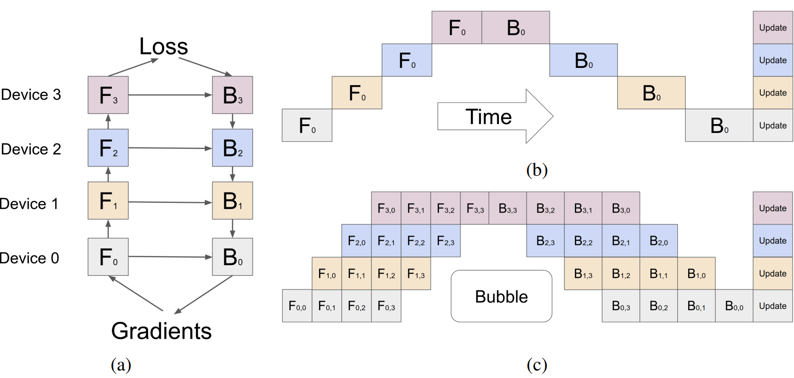

# Distributed training

Training ML models on multiple GPUs/servers is called distributed training. The
vocabulary here is:

- *node* -- the name for a single physical machine (server)
- *process* -- the smallest computing unit, each node may have several
  processes, where usually one process has assigned a single GPU/TPU
- *world size* -- the number of processes for all nodes
- *rank* -- index of a particular process

So for training on 2 servers, each with 4 GPUs we have:

- 2 nodes (== 2 servers)
- 2 * 4 = 8 world size
- ranks go `[0, 1, 2, ..., 6, 7]`

## Communication between processes

Each distributed techniques requires synchronization across processes.
Synchronization can be a bottleneck if bandwidth is limited (such as
node-to-node communication). Therefore it's worth to pick distributed strategy
that matches your hardware setup.

The synchronization between processes is a responsibility of a so-called
*backend*. The most used backend for GPU training is [Nvidia Collective
Communication
Library](https://docs.nvidia.com/deeplearning/nccl/user-guide/docs/index.html#)
(*NCCL*). To be able to visualize the parallelisation methods' communication,
it's useful to get familiar with the NCCL's [collective
operations](https://docs.nvidia.com/deeplearning/nccl/user-guide/docs/usage/collectives.html).

Managing the communication between processes is actually a rabbit hole in
itself. Here is an example of it: [Deep dive into All-reduce by Marek
Kolodziej](https://marek.ai/allreduce-the-basis-of-multi-device-communication-for-neural-network-training.html).

## Overview

The real-world techniques use different parallelisation concepts.

### Data parallelisation (*DP*)

Model parameters are replicated across processes. Each process gets a slice of a
mini-batch, computes forward and backward pass. Then gradients are averaged
across processes.

In detail, DP:
1. partitions each mini-batch across processes, so each process gets a slice of
   a mini-batch
2. each process does forward and backward pass, getting gradients and updating
   optimizer states
3. gradients are averaged across processes
4. each process applies gradients to parameters

The synchronization in the third step is done using
[all-reduce](https://docs.nvidia.com/deeplearning/nccl/user-guide/docs/usage/collectives.html#allreduce),
which is implemented by 2 consecutive operations:
1. [reduce-scatter](https://docs.nvidia.com/deeplearning/nccl/user-guide/docs/usage/collectives.html#reducescatter) -- each process reduces a partition of all gradients
2. [all-gather](https://docs.nvidia.com/deeplearning/nccl/user-guide/docs/usage/collectives.html#allgather) -- reduced portions of gradients are gathered from all processes
   and distributed among them

So for a model with $\Psi$ parameters, the step 3 needs to transfer $2\Psi$
numbers.

**Advantages**:
- Easy to implement -- usually this requires few wrappers around `DataLoader`s
  and `torch.nn.Module`s. For more detail you can checkout
  [`DistributedDataParallel`](./distributed_training_with_pytorch.md) that
  implements data parallelisation in PyTorch.
- High-throughput -- only a single synchronization (averaging of gradients) for
  each training step
- Compared to MP below, DP has better scaling efficiency
  - MP's communication overhead grows linearly with the number of processes
  - DP's communication stays constant as number of processes grows, while the
    volume of processed data grows linearly

**Disadvantages**:
- Wasted VRAM -- model is replicated for each process. This means that all
  parameters exist several times.
- Cannot be used if the model doesn't fit into single GPU VRAM

### Model parallelisation (*MP*)

Model parameters are partitioned vertically across processes -- each process
gets few layers/a block of the model. Batches are fed from one process to
another. Computed loss needs to reverse the same path as gradients from the
following layer, which might be stored in different process, are needed to
compute gradients of this layer.

In naive implementation, only one mini-batch is handled at a time, then all
gradients are computed, and parameters are adjusted before new mini-batch gets
processed. This introduces a lot of waiting. Better implementation known as
Pipeline parallelisation (*PP*) schedules multiple mini-batches so that all
processes get exhausted for given time step.

**Advantages**:
- Saves VRAM -- no memory is wasted/replicated.
- Given enough processes we can train infinitely large models

**Disadvantages**:
- Large communication overhead -- each training step needs to pass through each
  process twice

### Tensor parallelisation (*TP*)

The most low-level parallelisation. Splits matrix multiplications across
processes.

**Advantages**:
- The only solution where not even a single layer can fit into a single process

**Disadvantages**:
- Huge communication overhead

## Parallelisation methods

The high-level concepts are the big ideas behind majority of the concrete
parallelisation methods. It's useful to understand the concepts as the methods
often differ slightly from each concept: a little tweak there, a little
compromise there.

- `DataParallel` from PyTorch
  - Single process owns several GPUs, implementing DP with threads.
  - Most basic parallelisation strategy there is, but also the *slowest*.
  - Further described in [Distributed training w/ PyTorch](./distributed_training_with_pytorch.md)
- `DistributedDataParallel` from PyTorch
  - We could say this is the vanilla DP implemented in PyTorch.
  - Further described in [Distributed training w/ PyTorch](./distributed_training_with_pytorch.md)
- MegatronLM
  - Implementation of TP (Called MP in ZeRO paper).
  - TODO: read paper: https://arxiv.org/pdf/1909.08053
- ZeRO
  - Optimized of DP with several other tweaks.
  - Further described in [ZeRO](./zero.md)
- GPipe, PipeDream
  - Implementation of PP.
  - TODO: read the papers
- FSDP
  - Optimized implementation of DP
  - TODO: read the paper

## Parallelisation implementations

There are several libraries that implement parallelisation methods:

- [`accelerate` from 🤗](./hf_accelerate.md)
  - implements FSDP, MegatronLM, ZeRO
  - works with PyTorch
- [DeepSpeed](https://www.deepspeed.ai/)
  - implements ZeRO and other stuff I don't understand yet
  - works with PyTorch
- [Pytorch's `DistributedDataParallel` and
  `DataParallel`](./distributed_training_with_pytorch.md)
  - implements only DP via the mentioned classes

---

Sources:
- [Blog post by Sumanth R Hegde](https://sumanthrh.com/post/distributed-and-efficient-finetuning/) -- nice overview of ZeRO and FSDP
- [Blog post by Lilian Weng](https://lilianweng.github.io/posts/2021-09-25-train-large/) -- More exhaustive overview of parallelisation methods.
- [ZeRO paper](./zero.md) -- outsourced some key observations of parallelisation
  methods
