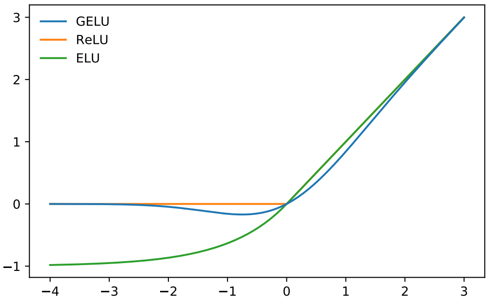

# GeLU

GeLU or Gaussian Error Linear Unit is an alternative to ReLU. It was introduced
by [Hendrycks et al. (2016)](https://arxiv.org/pdf/1606.08415) and used in [BERT
paper](https://arxiv.org/pdf/1810.04805). GeLU is defined as:

$$
\operatorname{GeLU}(x) = \Phi(x)x,
$$

where $\Phi(x)$ is a CDF of $N(0, 1)$. Since CDF of Normal distribution is
difficult to compute (integral cannot be simplified), an approximation is used:

$$
\operatorname{GeLU}(x) = 0.5x\left(1 +
  \tan\left[
    \sqrt{\frac{2}{\pi}}
    \left(x + 0.044715x^3\right)
  \right]
\right)
$$

## Reasoning

The authors reasoning was to combine dropout (stochastically multiply input by
one or zero) and ReLU (multiply the input by one or zero depending on the
input's value). And so they used Bernoulli distribution to sample $m$: $m \sim
\operatorname{Bernoulli}(\Phi(x))$ to multiply $x$ with: $xm$. This would cause
the output of GeLU to be:

- almost zero for large negative inputs
- almost linear for large positive inputs
- smooth transition near 0.

However, to avoid sampling random number constantly, they instead used the
expected value of $xm$, which is $\Phi(x)x$.

