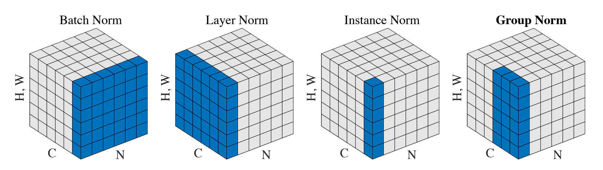

# Layer Normalization

Introduced in [a paper by Lei Ba et al. 2016](https://arxiv.org/abs/1607.06450).

## Definition

Layer normalization is applied for all dimensions of a single input.

- $N$ is batch dimension
- $H$, $W$ is height and width of 3D input
- $C$ are channels of 3D input

