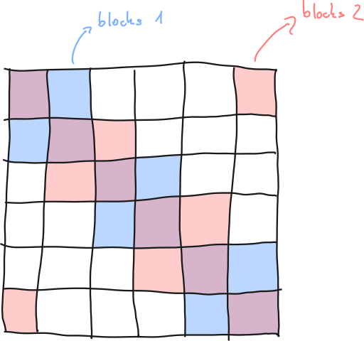

[paper]: https://arxiv.org/abs/2309.12307
[lora_paper]: https://arxiv.org/abs/2106.09685

# Long Low Rank Aadptation

An efficient way how to prolong the context length of LLMs [introduced by Chen
et al. (2023)][paper].

The authors use Low-Rank Adaptation plus a kind of sparse attention to
effectively scale context length of LLMs with fine-tuning of only thousand of
steps.

## Low-Rank Adaptation

The method is described in full in its own [paper][lora_paper] written by Hu et.
al (2021).

Essentially it is replacing a weight matrix $W \in \mathbb{R}^{d\times m}$ by
multiplication of two matrices $AB$, where $A \in \mathbb{R}^{d\times k}, B \in
\mathbb{R}^{k\times m}$ such that $k << \min(d, m)$.

### Application

Classical LoRA is applied to all weights of
[self-attention](./transformer_self_attention.md) $W_Q, W_K, W_V, W_O$ and the
transformer is trained with all other layers *frozen*. However, when fine-tuning
for long inputs, the authors showed that classical LoRA is uncapable. The
solution was to unfreeze embedding and normalization weights. These occupy only
a very small fraction of model's parameters.

## Shift sparse attention

Shift-sparse attention is blocked sparse attention that uses two sequences of
blocks that overlap each other. Image is maybe more descriptive:

The authors suggest:
- fairly large block size like 2048 tokens
- assigning one type blocks to half of attention heads, the other type of blocks
  to the other half

### Implementation

The implementation is quite straight forward:

1. Context: we have $Q, K, V$ for all heads. Ergo tensors of shape `[B, N, H,
   D]` for `B` batches, `N` input lenght, `H` heads computing in dimension `D`.
2. We split the tensors along the `H` dimension to two chunks
3. For second chunk we roll by $-G/2$ along the `N` dimension, where $G$ is
   block size.
4. Concatenate the unchanged and rolled chunks in the `H` dimension.
5. We view the tensors as `[B * N/G, G, H, D]`. Therefore viewing each block in
   isolation.
6. Compute classical self-attention. We get `[B*N/G, G, H, D]`. We therefore get
   for each block across all batches and attention heads a single vector of
   dimension `D` for each position within the given block.
7. Combination of viewing, unrolling along `H` and concatenating along `H`. This
   is where the authors wrongly assume that the self-attention returns a tensor
   of shape `[B, N, H, D]`. But doesn't clarify should the overlapping blocks
   put together.

