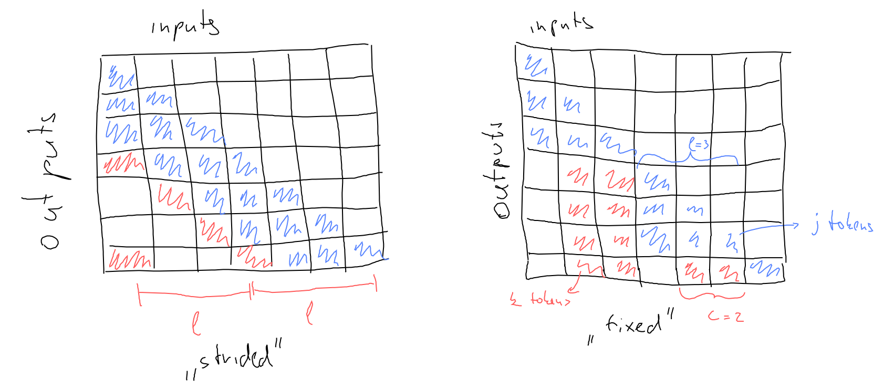

[paper]: https://arxiv.org/abs/1904.10509
# Sparse Transformer

An adjusted transformer decoder for longer sequences introduced in a paper by
[Child et al. (2019)][paper].

The paper introduced different kind of attention called sparse attention, where
each query token would attend to just few key tokens. This speads up computation
and reduced the originaly quadratic memory cost of self-attention to just
$O(n\sqrt{n})$. Additionally the paper introduces few changes to the traditional
transformer architecture that uses residual blocks to be able to scale the
architecture to hundreds of layers.

The paper also mentions:
- gradient checkpointing
- using fp16

## Sparse attention

The idea behind the sparse attention is to attend to as few tokens as possible
while **providing a path of tokens through which information can travel between
two arbitrary tokens**. E.g. let's say we have token $i$ and $j$ and we want
some information to travel from $j$ to $i$. We need tokens $k_0, k_1, \ldots
k_m$ such that $k_0$ attends to $j$, $k_1$ attends to $k_0$, ..., and finally
$i$ attends to $k_m$.

Concretely the authors use two kinds of sparse attention: *strided* and *fixed*.

When using *strided* attention, a query token attends to past (remember we're
dealing with decoders, so no attention to future inputs) $l-1$ key tokens plus
to every $l$-th past token.

In *fixed* attention query token $i$ attends to all past key tokens up to $j:
\lfloor j/l \rfloor == \lfloor i/l \rfloor$ plus to all tokens $k: k \text{mod}
l \in \{l-c, l-c+1, \ldots l - 1, 0\}$. Basically for token 7, stride 4 and $c=2$ it
attends to:

- key tokens 7, 6, 5 ($j$ tokens)
- key tokens 2, 3, 4 ($k$ tokens)

The image should illustrate this more clearly:

### Recommendations

The authors suggest:
- $l \in \{256, 512, 1024\}, c \in \{8, 16, 32\}$
- for different heads to use different $c$ values
- strided attention for repetative inputs like images or some kinds of music,
  fixed attention for text

### Implementation

For implementation the used custom kernels eventhough the described attentions
can be efficiently computed by slicing out blocks from the query and key
matricies. The only one I am not sure of are the strides in *strided* attention.
The authors say "*attention with a stride $k$ can be computed by transposing the
matrix and computing a local window*. I am not sure about that.

