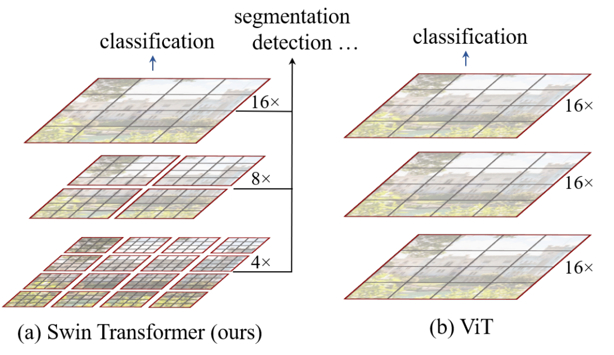
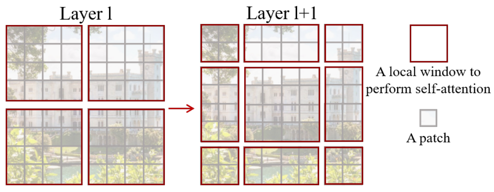

# Swin transformer

Swin transformer is an image-processing model able to classify or segment an
image. It was introduced by [Liu et al.
(2021)](https://openaccess.thecvf.com/content/ICCV2021/papers/Liu_Swin_Transformer_Hierarchical_Vision_Transformer_Using_Shifted_Windows_ICCV_2021_paper.pdf?ref=paperspace-blog).

The model surpassed pure CNNs for image segmentation and ViT for
image-classification tasks and became new SOTA architecture.

## Architecture

Architectually it's a continuation of ViT -- a model able to classify images
using the [Transformer](./transformer.md) architecture only. Swin transformer
uses a combination of [CNNs](./convolution_in_ml.md) and
[Transformer](./transformer.md) to build hierarchical representations which can
not only classify an image, but also segment it.

Swin Transformer patchifies the input image and treats the patches as tokens.
Then runs these tokens through modified Transformer blocks and creates first
representation of the input image. The next representations that represent
larger chunks of the image, Swin Transformer merges the neighbouring patches
(meaning each new patch embededs 2x2 older patches) and runs them through the
Transformer blocks once again.

.

The modified transformer block differs in the self-attention, which is replaced
by *Shifted window based self-attention*. Shifted window self-attention computes
only local attention as global attention isn't scalable to high-resolution. The
local attention is computed in windows containing a grid of patches (as seen on
the below figure). These windows don't overlap, and so in order to share
knowledge between windows, successive Transformer blocks use different scheme to
partition patches into windows, thus enabling knowledge sharing.

The authors use some clever implementation to avoid problems with differently
sized windows and use relative positional embedding to add a bias to the
self-attention computation.

