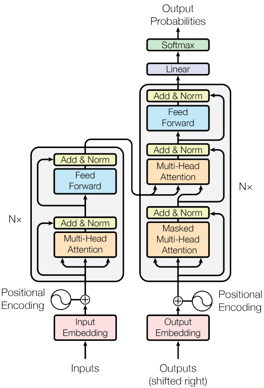

# Transformer

Transformer is a revolutionary architecture for sequence-to-sequence or just
sequence tasks, which was introduced by [Vaswani et al.,
(2017)](https://arxiv.org/pdf/1706.03762).

## Architecture

The model is composed of two sub-models: encoder and decoder. Encoder recieves
the input sequence, and makes the processed information available for the
decoder. Decoder predicts the target sequence using past true target tokens
(teacher forcing) and the input information provided by the encoder.

**Encoder** digests the input sequence via positional and semantic embedding
matricies. For text this means that each sub-word get positional and semantic
embedding. Though both embeddings can be trained, in the original paper only the
semantic embedding matrix was trained, while the positional embeddings were
computed. Then the input goes through several identical blocks. Each block
consists of [multi-head self-attention](./transformer_self_attention.md), and
feed-forward layers.

**Decoder** is similar to encoder, yet not entirely the same. Decoder too
ingests input through embeded tokens, which also pass through several identical
layers. The layers are also similar to encoder's layers:
1. self-attention
2. encoder-decoder attention
3. feed-forward layers.

### Attentions

There is a whole note about [self-attention](./transformer_self_attention.md),
so I mention only the specifics to its use. There are 3 usages of the attention
mechanism:
1. self-attention in encoder
2. self-attention in decoder
3. encoder-decoder attention

All types follow the basic computation but differ in some details. 1. is vanilla
self-attention as it is described in the above mentioned note. 2. is the same,
except its attention is masked out for upper diagonal to prevent the decoder
accessing future tokens. The diagonal is not masked since the decoder's input is
shifted by one. 3. is same as 1. except the values and keys are supplied by the
processed sequence *at the end of the encoder*. This allows the decoder to ask
for information from the input to generate the output.

### Feed-forward layers

Feed-forward layers include two feed-forward layers w/ ReLU between them which
are applied to each token separatelly. The first layer scales the input
dimension 4x, while the other scales it back down to the original size.

### Residual connections

In the original article there were two residual connections that went:
1. before the self-attention to after it
2. before the feed-forward layers to after them
Right after summing with the output of the avoided layer(s), there were
[layer-normalizations](./layer_normalization.md).

However, later it was discovered (as it was in ResNet in 2016) that putting the
layer normalization inside the computation branch before any other computation
is beneficial as the residual connection only contains sums and therefore
doesn't disturb the gradient. The first usage of these **pre-activation
residual** blocks in Transformers appears (AFAIK) in [Sparse transformers paper from
2019](./sparse_transformer.md).

