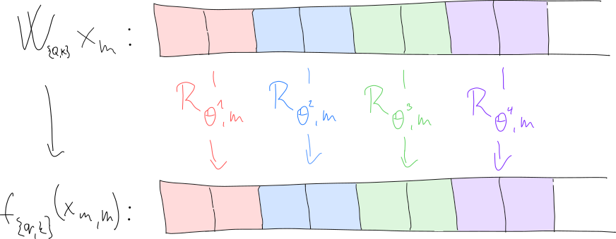

# Rotary position embeddings in Transformer architectures

Different way of encoding position information in [transformer's
self-attention](./transformer_self_attention.md) introduced by [Su et al.
(2023)](https://arxiv.org/abs/2104.09864).

## Motivation and idea

**Ro**tary **P**osition **E**mbedding (RoPE) aims to create key and query tokens
such that the dot-product between the two tokens in
[self-attention](./transformer_self_attention.md) would not get any information
about the absolute position of the two tokens. In other words so that the
dot-product of the $m$-th query vector $q_m$ and $n$-th key vector $k_n$ could
be formulated using some function $g$ that recieves only the two token
embeddings and relative difference in positions:

$$
\langle f_q(x, m), f_k(x, n) \rangle = g(x_m, x_n, m-n),
$$

where $f_{\{q, k\}}$ are functions that compute the query, key vectors (with
absolute position embeddings these are $f_{q}(x, m) = W_Q x_m$). The goal is to
find how to define $f_{\{q, k\}}$ such that the condition above holds. The
authors give detailed derivation that arrives to concrete definition.

## Formulation

If we assume the token embeddings are 2D, then RoPE will rotate the key and
query vectors by multiples of a fixed angle where the multiplier will be the
absolute position:

$$
f_{\{q, k\}}(x_m, m) = R_{\Theta, m}W_{\{q, k\}}x_m,
$$

where

$$
R_{\Theta, m} =
\begin{pmatrix}
\cos{m\theta} & -\sin{m\theta} \\
\sin{m\theta} & \cos{m\theta}
\end{pmatrix}
$$

For more dimensional embeddings, we will use the matrix $R$ for each consequtive
pair of dimensions:

Note that each rotation transformation gets their own $\theta$. (TODO: why?)

When the dot-product is computed the formula gets reduced:

$$
\begin{aligned}
\langle f_q(x, m), f_k(x, n) \rangle
&= (R_{\Theta, m}W_{q}x_m)^T R_{\Theta, n}W_{k}x_n \\
&= x_m^TW_{q}^T R_{\Theta, m}^T R_{\Theta, n} W_{k}x_n \\
&= x_m^TW_{q}^T R_{\Theta,n-m}  W_{k}x_n \\
\end{aligned}
$$

It really works out (thanks to those "$\sin{\alpha + \beta} =
\sin{\alpha}\cos{\beta} + \cos{\alpha}\sin{\beta}$" formulas) that $R_{\Theta,
m}^T R_{\Theta, n} = R_{\Theta,n-m}$.

So essentially the dot-product is done with a matrix "in-between". Obviously in
practice this would be inefficient as the matricies $R$ are very sparse. So it
is done (for a single vector: $Rx$) as a summation of two multiplications which
correspond to spelling out the matrix multiplication.

## Extending RoPEs

RoPEs are made to be quite easily extended. Compared to absolute position
embeddings, the transformer sees embeddings which it saw before while giving us
a way how to compute them.

Note that [Chen et al. (2023)](https://arxiv.org/abs/2306.15595) found that it
is more performant to interpolate the embeddings rather than extrapolate them
when finetuning. So when a model was pre trained with maximum angle of $m\theta$
when we try to quadruple the range don't use the maximum angle of $4m\theta$ but
rather divide the position by 4 before computing the angle.
